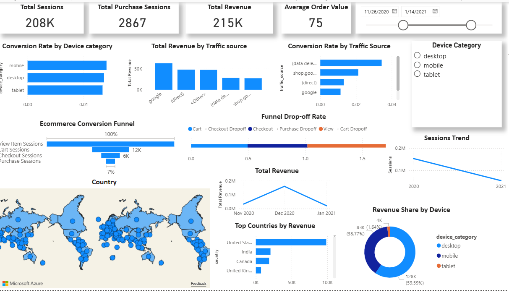

# GA4 Ecommerce Funnel Analysis

End-to-end analytics project analyzing **ecommerce funnel performance and revenue drivers** using **BigQuery, Python, and Power BI**.

This project simulates a real-world analytics workflow used by data analysts to investigate funnel drop-offs and revenue changes.

---

## Business Problem

Ecommerce companies often struggle to understand where customers drop off in the purchase journey.

The goal of this project is to analyze the ecommerce funnel and identify:

- Where the largest user drop-offs occur
- What factors drive revenue changes
- Opportunities to improve conversion rates

---

# Project Overview

This project analyzes the **Google Analytics 4 public ecommerce dataset** to identify where users drop off in the purchase funnel and what factors drive revenue changes.

The workflow includes:

- Data extraction and transformation in **BigQuery**
- Metric validation and revenue decomposition using **Python**
- Interactive dashboard development in **Power BI**

---

# Tools & Technologies

- **Google BigQuery** — SQL data extraction and transformation  
- **Python** — Data validation and revenue analysis  
- **Pandas** — Data manipulation  
- **Matplotlib** — Data visualization  
- **Power BI** — Interactive dashboard development  
---
## Data Source

Data is queried directly from Google BigQuery using the public dataset:

`bigquery-public-data.ga4_obfuscated_sample_ecommerce`

---

# Dataset

This dataset contains anonymized ecommerce event data including product views, cart additions, checkout activity, and purchases.

---

# Funnel Stages

The ecommerce funnel analyzed:

1. **View Item**
2. **Add to Cart**
3. **Begin Checkout**
4. **Purchase**

Key funnel metrics include:

- Conversion rates
- Drop-off analysis
- Revenue contribution

---
## Key Metrics

The following metrics were analyzed:

- Funnel conversion rate
- Add-to-cart rate
- Checkout completion rate
- Purchase rate
- Average Order Value (AOV)
- Total Revenue

---

# Key Insights

• The largest user drop-off occurs between **View Item → Add to Cart**

• Revenue decline was primarily driven by **changes in Average Order Value (AOV)** rather than conversion rate

• Funnel visualization highlights optimization opportunities in the product page experience

---

# Dashboard Preview

---

## Interactive Dashboard

Click below to explore the interactive report:

➡️ **[View Power BI Dashboard](https://app.powerbi.com/links/B7xy31YgnZ?ctid=c986676f-9b39-4d08-b4f8-a668e0e8c6a5&pbi_source=linkShare)**

---

# Repository Structure
'''
GA4/
│
├── powerbi/
│ └── GA4 Funnel.pbix
│
├── python/
│ └── revenue_decomposition.ipynb
│
├── sql/
│ └── Final Dataset for Power BI.sql
│
├── images/
│ └── dashboard_preview.png
│
├── README.md
└── .gitignore
'''

---

# Project Workflow

Step 1 — Build funnel dataset in **BigQuery**

Step 2 — Export dataset for analysis

Step 3 — Validate metrics and perform **revenue decomposition in Python**

Step 4 — Build interactive **Power BI dashboard**

---

# Author

Emma Tran  
Aspiring Data Analyst
